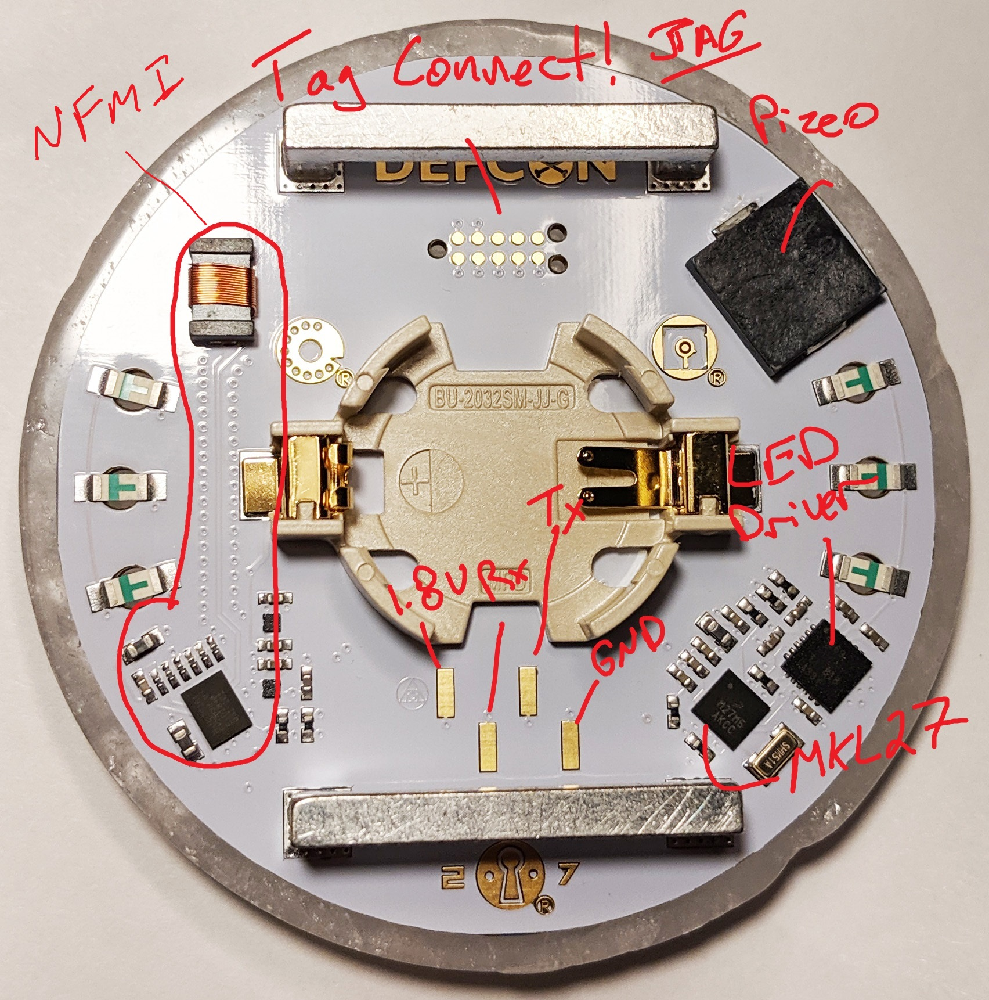

This repo has some notes @stacksmashing, @cryptotx, and @colinoflynn made quickly.

## Connections

Serial port is 1.8V. Orienting your badge with DEFCON at top, and counting from left to right:

1. vcc (1.8V)
2. TX from micro (output FROM micro, connect your RX here)
3. RX (input TO micro, connect your TX here)
4. Gnd

## Serial Port State

The serial port displays some boot messages:

	Welcome to the DEFCON 27 Official Badge
	
	Designed by Joe Grand [@joegrand] aka Kingpin
	grandideastudio.com/portfolio/defcon-27-badge/
	[*] Starting Initialization
	[*] MKL27Z64 Unique Identifier: 0x000000380014501150274E45 [32-bit: 0x772602EF]
	[*] Core Clock = 8000000Hz
	[*] Initializing Flash Memory
	-> Memory Size = 64KB [0x10000]
	-> Sector Size = 1KB [0x400]
	[*] Badge Type = Human
	[*] Badge State = Attract
	[*] Game Flags = 00000000
	[*] Magic Token = False
	[*] Testing Piezo...Done!
	[*] Configuring LED Driver...Done!
	[*] Configuring NFMI Radio
	-> Entering Bootloader...Done!
	-> Firmware Version: 0x01 0x00
	-> Hardware Version: 0x2261 0xA100
	-> ROM Version: 0x01 0x00
	-> Programming...Done!
	-> Executing Program...Done!
	-> Calibrating...Done!
	[*] Loading Data: 0xD7D7D2D6D0D2DEDFD0D0D0D0D0D0D0D0
	[*] Initialization Complete

If you connect a serial port, it then detects the RX pin being pulled high and says:

	[*] USB-to-Serial Adapter Detected
	[*] Entering Interactive Mode [Press 'H' for Commands]
	
	> H
	T: Display transmit packet
	R: Receive packet(s)
	C: Clear game flags
	H: Display available commands
	^: System reset
	
	Ctrl-X: Exit interactive mode

## Parts

### Main Micro - MKL27Z64

See NXP page.

### LED driver - LP5569

http://www.ti.com/lit/ds/symlink/lp5569.pdf

### NFM - nxh2261a1 (ask @stacksmashing how he managed to read this)

https://www.nxp.com/products/no-longer-manufactured/nfmi-radio-for-wireless-audio-and-data-streaming:NXH2280UK possibly

## Firmware

Tag-Connect is used. You need to mangle @cryptotx's tag-connect probe to make it fit, and the device firmware can be dumped. Firmware dump included here.

### Fun Addresses

At row 0xFC00 there is some data, storing game flags. You can write this row to different stuff to see flags toggle... set it to all FF's to get "hax0r" state and also rick roll yourself on reboot.